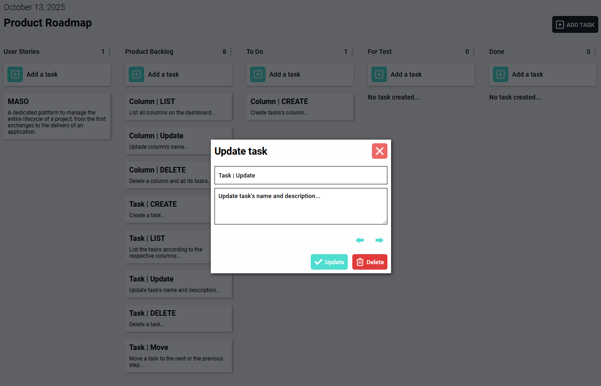

# MASO
A dedicated platform to manage the entire lifecycle of a project, from the first exchanges to the delivery of an application.

## Screeshoot of the application

## Tools used for
* vue@3.5.22
* vite@7.1.7
* pinia@3.0.3

## Features currently available on the app
**Please note:** The current version is only the front-end portion of the application. There are no back-end features and no permanent data backup.
(Application under development)

We use Pinia as a state management pattern to make data accessible from any component.

