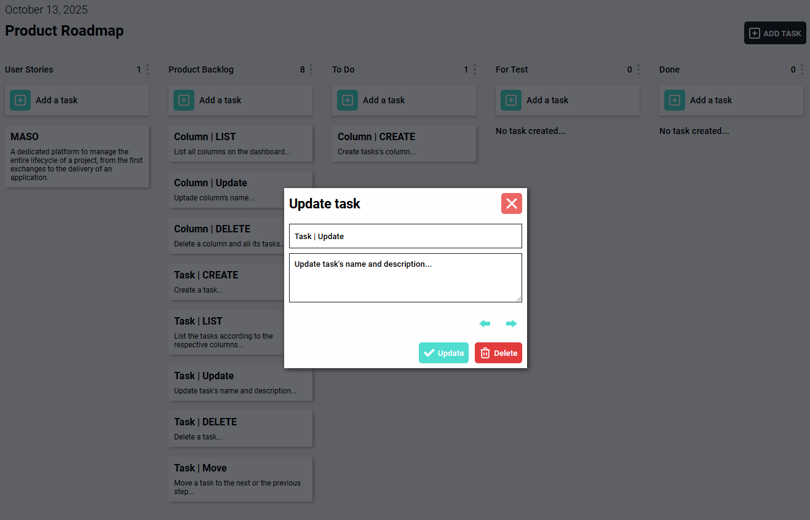
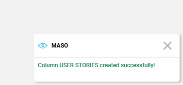

# MASO
A dedicated platform to manage the entire lifecycle of a project, from the first exchanges to the delivery of an application.

## Screenshot of the application


## Tools used for
* vue@3.5.22
* vite@7.1.7
* pinia@3.0.3

## Features currently available on the app
**Please note:** The current version is only the front-end portion of the application. There are no back-end features and no permanent data backup.
(Application under development)

We use Pinia as a state management pattern to make data accessible from any component.

### Column fonctionnality
We created and used a store named **useColumnStore** for all the data and functionality of a column

PS : All data is stored in a array

* Create, Update and Delete a column using **createColumn()**, **updateColumn()** and **deleteColumn()** methods

```Javascript
    export const useColumnStore = defineStore('columnStore', () => {
        let id = 0

        const columns = ref([])

        const createColumn = (columnName) => {
            columns.value.push({id: id++, title: columnName, tasksCount: 0})
        }

        const updateColumn = (columnId, newColumnName) => {
            columns.value.forEach((column) => {
                if(column.id === columnId) {
                    column.title = newColumnName
                }
            })
        }

        const deleteColumn = (columnId) => {
            // In a real use case, I must delete all tasks linked to this column before deleting the column itself
            columns.value = columns.value.filter(column => column.id !== columnId)
        }

        const increaseTaskCount = (columnId) => {
            columns.value.forEach((column) => {
                if(column.id === columnId) {
                    column.tasksCount = column.tasksCount + 1
                }
            })
        }

        const decreaseTaskCount = (columnId) => {
            columns.value.forEach((column) => {
                if(column.id === columnId) {
                    column.tasksCount = column.tasksCount - 1
                }
            })
        }

        return { columns, createColumn, updateColumn, deleteColumn, increaseTaskCount, decreaseTaskCount }
    })
```

* We use the **increaseTaskCount()** and **decreaseTaskCount()** methods to increase and decrease the number of tasks corresponding to each column.

In a modal, we call these methods using the following system

```Javascript
    import { useColumnStore } from '@/stores/columnStore';
```

Eg. : 
To create a column, we get the name of the new column using the **columnName** variable and the **v-model** directive on the input field.
The store provided by Pinia is stored into the **columnsStore** variable.
Next, we initialize the column creation functionality by running **initCreateColumn()** when the form is submitted.

```Javascript
    // DATA: used for column
    const columnsStore = useColumnStore()
    const columnName = ref('')

    // FUNCTION: CREATE COLUMN
    function initCreateColumn() {
        if(columnName.value.trim().length > 0) {
            columnsStore.createColumn(columnName.value)
            
            lunchNotification(true, `Column ${columnName.value.toUpperCase()} created successfully!`, success)

            columnName.value = ''
        }
        else {
            lunchNotification(true, `Please fill out the form!`, info)
        }

        emits('closeModal')
    }
```

### Task fonctionnality
We created and used a store named **useTaskStore** for all the data and functionality of a task

PS : All data is stored in a array

* Create, Update and Delete a task using **createTask()**, **updateTask()** and **deleteTask()** methods

```Javascript
    export const useTaskStore = defineStore('taskStore', () => {
        let id = 0

        const tasks = ref([])
        const columnStore = useColumnStore()

        const createTask = (columnId, taskName, taskDescription) => {
            const isTaskCreated = tasks.value.push({id: id++, columnId: columnId, title: taskName, description: taskDescription})
            return isTaskCreated? true : false
        }

        const updateTask = (taskId, newTaskName, newTaskDescription) => {
            tasks.value.forEach((task) => {
                if(task.id === taskId) {
                    task.title = newTaskName
                    task.description = newTaskDescription
                }
            })
        }

        const deleteTask = (taskId) => {
            tasks.value = tasks.value.filter(task => task.id !== taskId)
            return tasks.value? true : false
        }
        
        // Moving a task to the next or the previous step
        const nextStepTask = (taskId, columnId) => {
            const nextColumnId = columnId + 1
            const columns = columnStore.columns
            const isNextColumnExist = columns.filter((column) => column.id === nextColumnId).length

            if(isNextColumnExist) {
                tasks.value.forEach((task) => {
                    if(task.id === taskId) {               
                        task.columnId = nextColumnId
                    }
                })            
                return true
            }
            else {
                return false
            }
        }
        
        const prevStepTask = (taskId, columnId) => {
            const previousColumnId = columnId - 1
            const columns = columnStore.columns
            const isPreviousColumnExist = columns.filter((column) => column.id === previousColumnId).length

            if(isPreviousColumnExist) {
                tasks.value.forEach((task) => {
                    if(task.id === taskId) {
                        task.columnId = previousColumnId
                    }
                })
                return true
            }
            else {
                return false
            }
        }

        return { tasks, createTask, updateTask, deleteTask, nextStepTask, prevStepTask }
    })
```

* We move the position of the task using **nextStepTask()** and **prevStepTask()** methods by updating the column id

In a modal, we call these methods using the following system

```Javascript
    import { useTaskStore } from '@/stores/taskStore';
```

Eg. : 
To create a task, we get the name and the description of the new task using the **taskTitle** and **taskDescription** variables. And then, we aply the **v-model** directive on each input field.
The store provided by Pinia is stored into the **taskStore** variable.
Next, we initialize the task creation functionality by running **initCreateTask()** when the form is submitted.

```Javascript
    // DATA: used for task
    const taskStore = useTaskStore()
    const taskTitle = ref('')
    const taskDescription = ref('')

    // FUNCTION: CREATE TASK
    function initCreateTask() {
        if(
            taskTitle.value.trim().length > 0
        ) {
            const isTaskCreated = taskStore.createTask(columnId.value, taskTitle.value, taskDescription.value.trim().length > 0? taskDescription.value : '...')
            if(isTaskCreated) {
                columnStore.increaseTaskCount(columnId.value)

                lunchNotification(true, `Task ${taskTitle.value.toUpperCase()} created successfully!`, success)

                taskTitle.value = ''
                taskDescription.value = ''
            }
        }
        else {
            lunchNotification(true, `Please fill out the task name!`, info)
        }

        emits('closeModal')
    }
```

### Toast fonctionnality
We've created a toast for the notification system.

All toast configurations are stored in a store called **useToastStore**.

**isShow** to control the state using the **v-if** directive on the template
**message** informations to display depending on the event
**color** semantic meaning of the event

```Javascript
    export const useToastStore  = defineStore('toastStore', () => {
        /**
         * @type {isShow: Boolean, message: String}
         */
        const toast = ref({isShow: false, message: '', color: ''})

        const toastConfig = (isShow, message, color) => {
            toast.value.isShow = isShow
            toast.value.message = message
            toast.value.color = color
        }

        return {toast, toastConfig}
    })
```

How can we lunch the toast?

1- Import the store

```Javascript
    import { useToastStore } from '@/stores/toastStore';
```

2- Initialise color configuration

```Javascript
    // DATA: used for the toast
    const toastStore = useToastStore()
    const info = '#0d6efd'
    const danger = '#db3545'
    const success = '#198754'
``` 

3- Use **lunchNotification()** method

```Javascript
    // FUNCTION: NOTIFICATION
    function lunchNotification(isShow, message, type) {
        // Show notification
        toastStore.toastConfig(isShow, message, type)

        // Hide notification
        setTimeout(() => {
            toastStore.toastConfig(false, '')
        }, 5000)
    }
```

**setTimeout()** automatically hides the toast after 5 seconds

```Javascript
    lunchNotification(true, `Column created successfully!`, success)
```



**THIS APPLICATION IS UNDER DEVELOPMENT**

